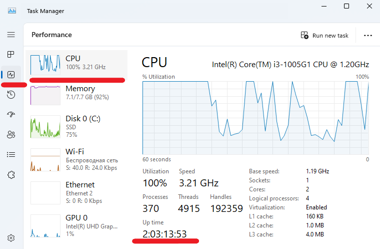

# How to Check System Uptime in Windows

Uptime refers to the amount of time a system, server, or device has been continuously running and available without any downtime or interruptions. It is often expressed as a percentage, indicating the reliability of the system over a specific period. For example, if a server has an uptime of 99.9%, it means that the server was operational and available 99.9% of the time during the measured period.

Uptime is a critical metric in IT and server management because it reflects the stability and reliability of a system. High uptime is often a goal for system administrators to ensure that services are consistently available to users or customers.

To check your system uptime in Windows, you can use several methods. Here are a few common ways.

## Using Task Manager

Press `Ctrl` `Shift` `Esc` to open the Task Manager and go to the `Performance` tab. Then select CPU from the left panel, look for the Uptime value near the bottom of the CPU section. This will show the time since the system was last started.

Continued on the [iolloi.icu](https://iolloi.icu/index.php/2024/08/27/how-to-check-system-uptime-in-windows/)
